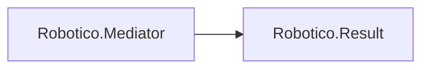

# Robotico.Mediator

[](https://dotnet.microsoft.com/download/dotnet/8.0)
[](https://dotnet.microsoft.com/download/dotnet/10.0)
[](https://learn.microsoft.com/en-us/dotnet/csharp/)
[](https://github.com/robotico-dev/robotico-mediator/packages)
[](https://github.com/robotico-dev/robotico-mediator/actions/workflows/publish.yml)

Lightweight mediator pattern for .NET 8 and .NET 10. CQRS-style request/handler dispatch with pipeline behaviors. Void and command requests return **Robotico.Result** for explicit success/error handling.

## Robotico dependencies



## Features

- **Contracts**: `IMediator`, `IRequest<TResponse>`, `IRequest` (void), `IRequestHandler<,>`, `IRequestHandler<>`, `ICommand`, `ICommand<TResponse>`, `IQuery<TResponse>`, `IPipelineBehavior<,>`
- **Single handler per request**: One handler per request type; resolved by request type at runtime. Assembly scan validates and throws if multiple handlers are registered for the same request.
- **Pipeline behaviors**: Cross-cutting concerns (logging, validation, transactions) in registration order; optional short-circuit. Void requests (`IRequest`) use the same pipeline as typed requests (via `IRequest` → `IRequest<Result>`).
- **Void/command results**: Handlers for `IRequest` return `Task<Result>` (Robotico.Result)
- **Assembly scan**: `AddMediator(services, assemblies)` discovers and registers handlers and pipeline behaviors. Use `AddMediatorScoped` or `AddMediator(services, ServiceLifetime.Scoped, assemblies)` for one mediator per scope (e.g. per HTTP request).
- **Performance**: Handler interface and `MethodInfo` are cached per (request type, response type); no reflection on the hot path.
- **Observability**: Structured logging (request type, duration, success/failure) at Debug level; failed requests logged at Warning.
- **SOLID**: Callers depend on `IMediator` and request types only; handlers depend on request and application services

## Installation

Add the GitHub Packages NuGet source (once per machine) so both packages can be restored:

```bash
dotnet nuget add source "https://nuget.pkg.github.com/robotico-dev/index.json" --name github --username YOUR_GITHUB_USERNAME --password YOUR_GITHUB_PAT --store-password-in-clear-text
```

Then add the packages:

```bash
dotnet add package Robotico.Mediator
dotnet add package Robotico.Result
```

**Robotico.Result** is published at [GitHub Packages (robotico-dev/robotico-results)](https://github.com/robotico-dev/robotico-results/pkgs/nuget/Robotico.Result). **Robotico.Mediator** is published at [GitHub Packages (robotico-dev/robotico-mediator)](https://github.com/robotico-dev/robotico-mediator/pkgs/nuget/Robotico.Mediator).

## Quick start

```csharp
using Microsoft.Extensions.DependencyInjection;
using Robotico.Mediator;
using Robotico.Result;

// Define request and handler
public record GetUserQuery(int Id) : IRequest<string>;

public class GetUserQueryHandler : IRequestHandler<GetUserQuery, string>
{
    public Task<string> HandleAsync(GetUserQuery request, CancellationToken cancellationToken = default)
        => Task.FromResult($"User-{request.Id}");
}

// Void/command returning Result
public record DeleteUserCommand(int Id) : IRequest;

public class DeleteUserCommandHandler : IRequestHandler<DeleteUserCommand>
{
    public Task<Result> HandleAsync(DeleteUserCommand request, CancellationToken cancellationToken = default)
        => Task.FromResult(Result.Success());
}

// Register (assembly scan). Use AddMediatorScoped for one mediator per scope (e.g. per HTTP request).
services.AddLogging();
services.AddMediator(typeof(GetUserQueryHandler).Assembly);

// Resolve and send
IMediator mediator = provider.GetRequiredService<IMediator>();
string name = await mediator.SendAsync(new GetUserQuery(42));
Result result = await mediator.SendAsync(new DeleteUserCommand(42));
```

## Pipeline behaviors

```csharp
public class LoggingBehavior<TRequest, TResponse> : IPipelineBehavior<TRequest, TResponse>
    where TRequest : IRequest<TResponse>
{
    public async Task<TResponse> HandleAsync(TRequest request, RequestHandlerDelegate<TResponse> next, CancellationToken cancellationToken = default)
    {
        // Before handler
        TResponse response = await next();
        // After handler
        return response;
    }
}
```

Register pipeline behaviors in the same assembly scan as handlers, or register them explicitly. They run in registration order; any behavior can short-circuit by not calling `next()`. To run behaviors for void/command requests, implement `IPipelineBehavior<IRequest<Result>, Result>` (they will run for all requests that return `Result`).

## Validation

Register validators for requests that implement `IRequest` (void/command). The built-in `ValidationPipelineBehavior` runs before the handler and short-circuits with `Result.ValidationError` when validation fails. Validators are discovered by assembly scan with handlers.

```csharp
public record CreateUserCommand(string Name, int Age) : IRequest;

public class CreateUserCommandValidator : IValidator<CreateUserCommand>
{
    public Result Validate(CreateUserCommand request)
    {
        var errors = new Dictionary<string, string[]>();
        if (string.IsNullOrWhiteSpace(request.Name))
            errors["Name"] = ["Name is required"];
        if (request.Age < 0 || request.Age > 150)
            errors["Age"] = ["Age must be between 0 and 150"];
        return errors.Count == 0 ? Result.Success() : Result.ValidationError(errors);
    }
}

public class CreateUserCommandHandler : IRequestHandler<CreateUserCommand>
{
    public Task<Result> HandleAsync(CreateUserCommand request, CancellationToken cancellationToken = default) =>
        Task.FromResult(Result.Success());
}
```

Register handlers and validators with `AddMediator(typeof(CreateUserCommandHandler).Assembly)`; the validation behavior is registered automatically.

## Testing

**Mocking the mediator in app tests:** Depend on `IMediator` and replace it with a test double that returns predefined results or delegates to a custom handler.

```csharp
public class FakeMediator : IMediator
{
    public Task<TResponse> SendAsync<TResponse>(IRequest<TResponse> request, CancellationToken cancellationToken = default) =>
        Task.FromResult(/* your test response */);
    public Task<Result> SendAsync(IRequest request, CancellationToken cancellationToken = default) =>
        Task.FromResult(Result.Success());
}

// In test setup:
services.AddSingleton<IMediator>(new FakeMediator());
```

**Unit-testing handlers in isolation:** Resolve the handler from a test `ServiceProvider` and call `HandleAsync` directly. No need to go through the mediator.

```csharp
var services = new ServiceCollection();
services.AddTransient<IRequestHandler<GetUserQuery, string>, GetUserQueryHandler>();
// ... register handler dependencies
var handler = services.BuildServiceProvider().GetRequiredService<IRequestHandler<GetUserQuery, string>>();
var result = await handler.HandleAsync(new GetUserQuery(42));
result.Should().Be("User-42");
```

## Design

- **SOLID**: Abstractions (interfaces) for mediator, requests, handlers, and behaviors; dependency on `IServiceProvider` for resolution
- **POLA**: One handler per request type; pipeline order is explicit and predictable; startup validation fails fast if multiple handlers exist for the same request
- **Pipeline order (void/command requests):** Built-in behaviors are registered in this order: **Validation** (inner, runs first), then **Observability** (outer, runs last). So at runtime: Observability → … → Validation → handler. Validation short-circuits on failure without calling the handler; Observability wraps the whole pipeline for logging and tracing.
- **Void pipeline**: `IRequest` extends `IRequest<Result>`, so void requests go through the same pipeline as typed requests
- **Result consistency**: Void/command handlers return `Result` so success and errors are explicit (no exceptions for domain failures)

## AOT and source generator

The main package uses reflection (with per-request-type caching) to resolve handlers. For **trimmed** or **AOT** deployments where reflection is undesirable, an optional **Robotico.Mediator.SourceGenerator** package is available: it emits a zero-reflection dispatcher at compile time. The generated mediator does *not* run pipeline behaviors, validation, or built-in logging—use it when you need zero-reflection dispatch and can add those concerns elsewhere if needed. Reference the source generator package in your application project; see `docs/design.adoc` (trim/AOT section) for when to use it and how to switch to the generated mediator. The core library remains the same; the source generator is an additive option.

## Documentation

Detailed architecture and design are in the `docs/` folder (AsciiDoc):

- **Index** (`docs/index.adoc`) — Quick links and doc build instructions
- **Architecture** (`docs/architecture.adoc`) — Type hierarchy, request flow, pipeline, exception boundary, registration
- **Design** (`docs/design.adoc`) — Single handler per request, pipeline order, void/Result consistency, when to use commands vs queries, performance, trim/AOT notes
- **Trim and AOT** (`docs/trim-aot.adoc`) — Reflection usage, optional source generator, trimmed/AOT deployment

To build HTML from the AsciiDoc sources (e.g. with Asciidoctor):

```bash
asciidoctor docs/architecture.adoc -o docs/architecture.html
asciidoctor docs/design.adoc -o docs/design.html
```

## Building and testing

From the repo root:

```bash
dotnet restore
dotnet build -c Release
dotnet test tests/Robotico.Mediator.Tests/Robotico.Mediator.Tests.csproj -c Release
```

To run tests with code coverage (Coverlet; optional gate: fail if line coverage &lt; 80%):

```bash
dotnet test tests/Robotico.Mediator.Tests/Robotico.Mediator.Tests.csproj -c Release --collect:"XPlat Code Coverage"
# With threshold (CI): dotnet test ... -c Release --collect:"XPlat Code Coverage" /p:CollectCoverage=true /p:Threshold=80 /p:ThresholdType=line
```

To run benchmarks (optional; from the repo root; requires building the benchmark project first):

```bash
dotnet build benchmarks/Robotico.Mediator.Benchmarks/Robotico.Mediator.Benchmarks.csproj -c Release
dotnet run -c Release -p benchmarks/Robotico.Mediator.Benchmarks -- --filter "*"
```

If you see an "Ambiguous project name" error when building the benchmark project, build from the repository root (e.g. in a clone of [robotico-dev/robotico-mediator](https://github.com/robotico-dev/robotico-mediator)).

## Analyzer suppressions (NoWarn)

The library intentionally suppresses the following analyzers; rationale is documented here for principal-grade transparency:

| Code | Rationale |
|------|------------|
| **CA1716** | Parameter name `request` in `SendAsync` matches a reserved language keyword style; renaming would harm API clarity and consistency with the mediator pattern. |
| **CA1848** / **CA1873** | Logging extension methods use the logger message template; the analyzer's suggestion would reduce structured logging quality. |
| **CA1040** / **CA1711** | Suppressed at type level on marker interfaces (`IRequest<TResponse>`, `IRequest`, etc.) and delegate type `RequestHandlerDelegate`; empty/marker interfaces and delegate naming are standard in mediator-style APIs. |

All other warnings are treated as errors (`TreatWarningsAsErrors`). See `Directory.Build.props` and `.csproj` for the full build bar.

**Public API:** This library uses `Microsoft.CodeAnalysis.PublicApiAnalyzers`. To populate `PublicAPI.Shipped.txt`, apply the code fix "Add to PublicAPI.Unshipped" (Fix All in project), then at release move entries to `PublicAPI.Shipped.txt`.

## Dependencies

- **Robotico.Result**: Void/command results ([GitHub Packages](https://github.com/robotico-dev/robotico-results/pkgs/nuget/Robotico.Result))
- **Microsoft.Extensions.DependencyInjection.Abstractions**
- **Microsoft.Extensions.Logging.Abstractions**

## License

See repository license file.
